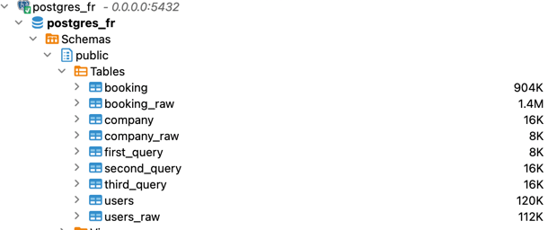

# Postgres Data Engineering Project

## Architecture
Project consists of python script `main.py` which executes:
1. Uploading csv files into `_raw` tables in Postgres
2. Lightweight ETL of those tables
3. Execution of Analytics queries

## Prerequisites   

To use the template, please install the following. 

1. [git](https://git-scm.com/book/en/v2/Getting-Started-Installing-Git)
2. [Github account](https://github.com/)
3. [Docker](https://docs.docker.com/engine/install/) with at least 4GB of RAM and [Docker Compose](https://docs.docker.com/compose/install/) v1.27.0 or later

Local Postgres DB is used for spin within docker container

### Setup infra

Pull current repository and specify your env variables in `.env` file:
```env
POSTGRES_HOST=database
POSTGRES_USER=postgres
POSTGRES_PASSWORD=super_password
POSTGRES_DB=postgres_fr
POSTGRES_PORT=5432
```
Run the following commands in your project directory.

```shell
python3 -m venv venv
source venv/bin/activate
docker-compose build # build the docker containers on your computer
docker-compose up # spin up the docker containers
```
You will see the following db tables after running the script


### Reasoning
- Which principles should you follow when building pipelines, and are there any anti-patterns you would avoid? 
1. Clear data flow: to have a well-defined data flow. Identify the source of data, the transformations or processing steps to be applied. Avoid speghetti code, distincguish raw, staging, final data
2. DRY principle or Reusability: Break down data pipeline into modular components or stages. Each component should be reusable, independent, and focused on a specific task.
3. Idempotency: to produce the same result regardless of how many times it is executed
4. Quality checks: Implement data validation and quality checks at various stages of the pipeline, including integrity, consistency, accuracy, and completeness.
5. Data Cleaning or Business ETL: implementing steps to clean data according to business needs (nulls, trims, datatyping, invaid time formatting), aka Data Marts
6. Monitoring and Logging: comprehensive monitoring and logging mechanisms 
7. Data Security: Implement security best practices. Like not storing your passwords in project files
8. Versioning and Documentation: Add versioning and write documentation. Like git repo, extra current_timestamp columns, etc.
9. Testing: Conduct unit tests, validate the correctness and performance of the pipeline.

- How would you improve your current solution further, if you had more time? 
1. I would rewrite processing csv files to pandas and pushing pandas df to sql tables with more robust data checks;
2. Added versioning metadata to the initial load step;
3. Add unit tests to each function;
4. Clarify many Business questions, including (but not limited to): u.demo_user is false, created_at is not null, is_demo is false;


to run the tests
```shell
pipenv run pytest -v test_main.py -vv
```


